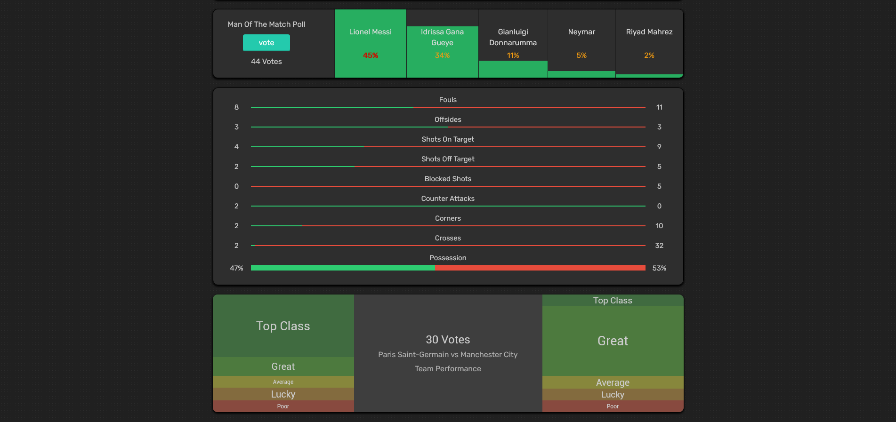

# Footyroom Ash Dark
This is a dark userstyle for Footyroom. It completely restyles the website to dark and redesigns some elements to better fit in with the theme. 

## Install and setup
In order to use this theme or any other userstyles you will need to install a browser extension. I recommend using the Stylus extension.

### Browser extension:
Get the Stylus addon for:

### Install this theme:
Once you have installed the browser extension click on the link below to install this theme.

  >Installs directly from this repository.
  >This is only available using Stylus (see the [documentation](https://github.com/openstyles/stylus/wiki/Usercss)).

## Screenshots
### Home

### Match Review

### Comment Section

### Competitions

### Tips

### Forum

### Match Preview

## License
[GNU GPLv3](LICENSE)